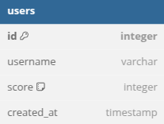
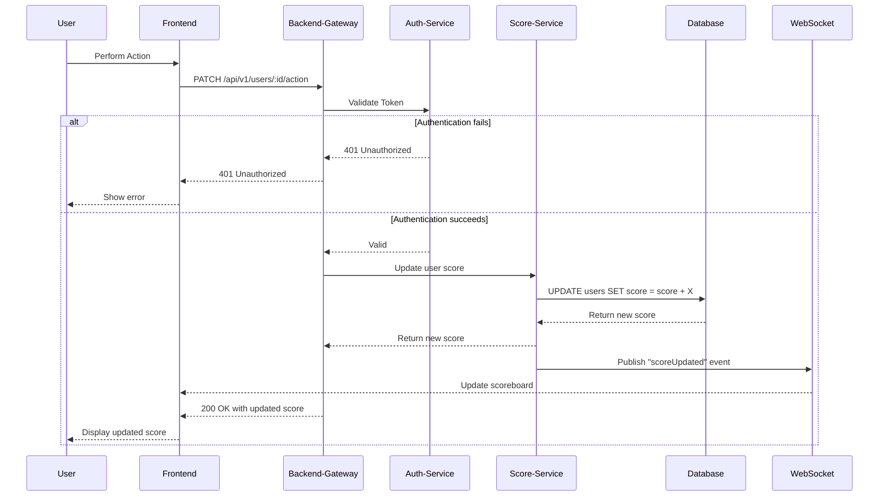

# Score Board API Module

## Overview

This module powers a **live-updating** scoreboard on your website. It supports secure score updates, retrieves the top 10 user scores, and broadcasts real-time changes to ensure users always see the latest standings. 

The specification focuses on:
1. **Secure Score Updates**: Ensuring only authenticated, valid users can modify scores.  
2. **Top 10 Score Retrieval**: Efficiently fetching the highest scores for display.  
3. **Real-Time Updates**: Providing near-instant scoreboard refresh for all connected clients. 

## Table of Contents

1. [Features](#features)  
2. [Tech Stack](#tech-stack)  
3. [API Endpoints](#api-endpoints)  
   - [1. Get Top 10 Scores](#1-get-top-10-scores)  
   - [2. Update Score (Perform Action)](#2-update-score-perform-action)  
4. [Database Schema](#database-schema)  
5. [Execution Flow Diagram](#execution-flow-diagram)  
6. [Security Measures](#security-measures)  
7. [Performance and Scalability Considerations](#performance-and-scalability-considerations)  
8. [Additional Suggestions & Future Improvements](#additional-suggestions--future-improvements)  

## Features

- **Live Update**: Real-time broadcast of score changes to the scoreboard.  
- **Top 10 Scores**: Quickly fetches the highest-ranked users.  
- **Secure Score Update**: Ensures only valid, authenticated actions can modify scores.  

## Tech Stack

- **Node.js & Express.js** for API server.  
- **PostgreSQL** for data persistence.  
- **Socket.io** (or alternative) for real-time communication.  
- **JWT or OAuth2** for secure authentication/authorization.  

## API Endpoints

### 1. Get Top 10 Scores
-   **Endpoint**: `/api/v1/scores/top`
-   **Description**: Retrieves the top 10 user scores, ordered descending by score.
-   **Method**: `GET`
-   **Response**:
```json
{ 
	"top_scores": [ 
		{"user_id": 1, "score": 100},
		{"user_id": 7, "score": 68},
		 ... 
	] 
}
```

### 2. Perform Action
-   **Endpoint**: `/api/v1/users/:id/action`
-   **Description**: Increments the user’s score upon completion of an action. The actual action type can be any valid string (`"increase"`, `"decrease"`, etc.), but typically the incremented value should be validated server-side.
-   **Method**: `PATCH`
-   **Request Body**:
```json
{ 
	"action": "increase",
	"score": 10
}
```
-   **Request Header**:
```json
{ 
	"Authorization": "***user_token***",
}
```
**Response**:

-   **200 OK**: 
```json
  {
    "status": "success",
    "message": "Score updated successfully.",
    "newScore": 110
  }
  ```
-   **400 Bad Request**: Invalid request data.
-   **401 Unauthorized**: Authentication failed.
-   **500 Internal Server Error**: Server error.


## Database Schema

Here is the database schema:



## Execution Flow Diagram

Below is a **Mermaid** sequence diagram illustrating the overall API interaction, including authentication and real-time notifications.


1. **User** triggers an action.  
2. **Frontend** sends a PATCH request to the **Backend-Gateway**.  
3. **Backend-Gateway** relies on **Auth-Service** to validate the token.  
4. If valid, **Score-Service** handles the score update in the **Database**.  
5. A **WebSocket** message is published to notify all clients about the new score.  
6. Frontend receives the **updated** scoreboard and displays it to the user.  

## Security Measures

1. **JWT/OAuth2**: Use a robust authentication mechanism (e.g., JWT) to verify that only authorized users can update scores.  
2. **Server-Side Validation**: Ensure the requested `score` increment or `action` is valid and within expected ranges to prevent abuse.  
3. **Rate Limiting**: Limit the number of requests per user/IP in a given timeframe to mitigate malicious calls.  
4. **Secure Transport**: Enforce HTTPS/TLS to protect data in transit.  
5. **Monitoring & Logging**: Keep track of unusual patterns (e.g., frequent large score increases) and trigger alerts.  


## Performance and Scalability Considerations

1. **In-Memory Caching**: Use Redis or Memcached to store top 10 scores for **low-latency** retrieval.  
2. **Database Indexing**: Index the `score` column for fast ordering, especially if the user base grows.  
3. **Horizontal Scaling**: Employ container orchestration (e.g., Kubernetes) for load balancing across multiple server instances.  
4. **Real-Time Updates**:  
   - **Socket.io** or **WebSockets** for two-way communication.  
   - **Server-Sent Events (SSE)** if only one-way (server-to-client) updates are needed.  

## Additional Suggestions & Future Improvements

1. **Pub/Sub for Real-Time**:  
   - If you anticipate high concurrency, integrate a **Pub/Sub** system (e.g., Redis Pub/Sub or Kafka) to handle broadcasting updates across multiple server nodes.  

2. **Role-Based Access Control (RBAC)**:  
   - If different user roles (admin, player, guest) exist, consider scoping permissions, such as restricting who can view certain endpoints or adjust scores.  

3. **API Gateway**:  
   - A dedicated gateway (e.g., Kong, NGINX, or AWS API Gateway) can provide advanced features like caching, dynamic routing, token verification, and rate limiting at the edge.  

4. **Analytics & Leaderboards**:  
   - Expand scoreboard features to include monthly or all-time leaderboards, historical score trends, etc.

### How to Use This Specification

1. **Implementation**:  
   - Pass these API endpoints and flow diagrams to your backend engineering team.  
   - Configure environment variables for DB connections, JWT secrets, and other sensitive settings.  
2. **Testing**:  
   - Write unit tests for controllers, services, and database operations.  
   - Perform integration tests to validate the entire flow from token authentication to final scoreboard update.  
3. **Monitoring**:  
   - Monitor logs and metrics (e.g., CPU usage, DB I/O, response times) to ensure the system remains performant.  